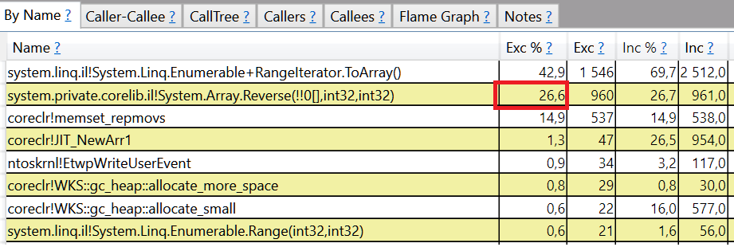

# Microbenchmark Design Guidelines

## General Overview

* Choose a good name because you won't be able to change it after the first results are uploaded to the Reporting System.
* Move initialization logic to a Setup method. Don't forget to clean up the resources in a corresponding Cleanup method.
* If your benchmark needs input data, it should be always exactly the same data. Use `ValuesGenerator` to generate the data.
* Benchmark should have one test case per one code path of the benchmarked code. Not more.
* Focus on the most common use cases, not edge cases. Performance of error cases is almost never interesting.
* Make sure the benchmark has no side-effects.
* Return the result from the benchmark to prevent dead code elimination.
* Try to avoid adding loops to your benchmark, BenchmarkDotNet is going to invoke the benchmark many times for you instead.

## Table of Contents

- [Microbenchmark Design Guidelines](#microbenchmark-design-guidelines)
  - [General Overview](#general-overview)
  - [Table of Contents](#table-of-contents)
  - [Mindset](#mindset)
    - [Benchmarks are not Unit Tests](#benchmarks-are-not-unit-tests)
    - [Benchmarks are Immutable](#benchmarks-are-immutable)
  - [BenchmarkDotNet](#benchmarkdotnet)
  - [Setup](#setup)
    - [GlobalSetup](#globalsetup)
    - [IterationSetup](#iterationsetup)
    - [OperationsPerInvoke](#operationsperinvoke)
  - [Test Cases](#test-cases)
    - [Code Paths](#code-paths)
      - [Array.Reverse](#arrayreverse)
      - [Buffer.CopyMemory](#buffercopymemory)
    - [Always the same input data](#always-the-same-input-data)
    - [BenchmarkDotNet](#benchmarkdotnet-1)
      - [Arguments](#arguments)
      - [Params](#params)
      - [ArgumentsSource](#argumentssource)
      - [Generic benchmarks](#generic-benchmarks)
      - [Allowed operating systems](#allowed-operating-systems)
  - [Best Practices](#best-practices)
    - [Single Responsibility Principle](#single-responsibility-principle)
    - [No Side-Effects](#no-side-effects)
    - [Dead Code Elimination](#dead-code-elimination)
    - [Loops](#loops)
    - [Method Inlining](#method-inlining)
    - [Be explicit](#be-explicit)
    - [Add Categories](#add-categories)

## Mindset

Writing Benchmarks is much different than writing Unit Tests. So before you start coding, you need to change your mindset first.

### Benchmarks are not Unit Tests

When writing Unit Tests, we ideally want to test all methods and properties of the given type. We also test both the happy and unhappy paths. The result of every Unit Test run is a single value: passed or failed.

Benchmarks are different. First of all, the result of a benchmark run is never a single value. It's a whole distribution, described with values like mean, standard deviation, min, max and so on. To get a meaningful distribution, the benchmark has to be executed many, many times. **This takes a lot of time**. With the current [recommended settings](https://github.com/dotnet/performance/blob/51d8f8483b139bb1edde97f917fa436671693f6f/src/harness/BenchmarkDotNet.Extensions/RecommendedConfig.cs#L17-L20) used in this repository, it takes on average six seconds to run a single benchmark.
The public surface of .NET Standard 2.0 API has tens of thousands of methods. If we had 1 benchmark for every public method, it would take two and a half days to run the benchmarks. Not to speak about the time it would take to analyze the results, filter the false positives, etc..

This is only one of the reasons why writing Benchmarks is different than writing Unit Tests.

The goal of benchmarking is to test the performance of all the methods that are frequently used (hot paths) and should be performant. **The focus should be on the most common use cases, not edge cases**.

### Benchmarks are Immutable

The results of benchmark runs are exported to an internal Reporting System. Every benchmark is identified using the following `xUnit` ID pattern:

```cmd
namespace.typeName.methodName(paramName: paramValue)
```

To be able to track the performance over time, we **must NOT change the ID**. It means that every change to a namespace, type name, method name, parameter name|value is considered to be a breaking change and must be avoided if possible.


The Reporting System is used to monitor the performance changes and detect regressions. If the body of the benchmark is changed, the old name is kept and the reported time increases, it's going to be marked as regression and require a dedicated performance investigation. We want to avoid such false alarms and hence we want to reduce the number of changes in existing benchmarks to a minimum.


If you have some good reasons for changing the implementation of the benchmark you should remove the old one and introduce a new one with a new name.

## BenchmarkDotNet

BenchmarkDotNet is the benchmarking harness used in this repository. If you are new to BenchmarkDotNet, you should read [this introduction to BenchmarkDotNet](./benchmarkdotnet.md).

Key things that you need to remember:

* BenchmarkDotNet **does not require the user to provide the number of iterations and invocations per iteration**, it implements a smart heuristic based on standard error and runs the benchmark until the results are stable.
* BenchmarkDotNet runs every benchmark in a separate process, process isolation allows avoiding side-effects. The more memory allocated by given benchmark, the bigger the difference for in-proc vs out-proc execution.
* BenchmarkDotNet was designed to make accurate nano-benchmarks with repeatable results possible, to achieve that it does many things, including overhead calculation and subtraction (it benchmarks an empty method with the same signature and subtract the average value from results).
* BenchmarkDotNet removes outliers by default (this repo is configured to remove only the upper outliers)
* BenchmarkDotNet creates a type which derives from type with benchmarks. So the type with benchmarks must **not** be **sealed** and it can **not** be **static** and it has to be **public**. It also has to be a `class` (no structs support).

**Note:** If you are not sure what invocation or iteration means, please read [this doc](https://benchmarkdotnet.org/articles/guides/how-it-works.html) that explains how BenchmarkDotNet works.

## Setup

Let's write a benchmark that measures the performance of reversing an array of 1 000 integers:

```cs
[Benchmark]
public int[] Reverse()
{
    int[] array = Enumerable.Range(0, 1_000).ToArray();

    Array.Reverse(array);

    return array;
}
```

Profile it using the [ETW Profiler](./benchmarkdotnet.md#Profiling):

```cmd
dotnet run -c Release -f netcoreapp3.1 --filter '*.Reverse' --profiler ETW
```

And open the produced trace file with [PerfView](https://github.com/Microsoft/perfview):



As you can see, reversing the array took only `26.6%` of the benchmark execution time! The rest was spent on executing the array creation logic. What does it mean? It means that the given benchmark is measuring the performance of creating and reversing the array. Not just reversing the array.

This is why **the initialization logic should be always separated from the benchmark**.

### GlobalSetup

A public method marked with `[GlobalSetup]` attribute is going to be executed **exactly once**, before running the benchmark for the first time.

```cs
private int[] _array;

[GlobalSetup]
public void SetupReverse() => _array = Enumerable.Range(0, 1000).ToArray();

[Benchmark]
public void Reverse() => Array.Reverse(_array);
```

Any method marked `[GlobalSetup]` which does not specify the `Target(s)` benchmark name(s) is executed for every benchmark declared in a given class.

In case you want to have a class with multiple benchmarks and multiple, dedicated setup methods you need to use `Target` or `Targets` properties of the setup attribute:

```cs
[GlobalSetup(Target = nameof(Reverse))]
public void SetupReverse()

[GlobalSetup(Targets = new [] { nameof(Array), nameof(Span), nameof(ReadOnlySpan)})]
public void SetupArray()
```

**Note:** If you need to clean up resources after the benchmark run (an example of required cleanup would be any files created on the disk by the benchmark process), you should use the corresponding `[GlobalCleanup]` attribute. It's going to be executed only once, after all benchmark iterations.

### IterationSetup

If your benchmark requires a clean state for every invocation, you need to use the `[IterationSetup]` attribute. Unfortunately, just using the `[IterationSetup]` attribute is not enough to get stable results. You also need to make sure that the benchmark itself performs enough of computations for a single invocation to run longer than 100ms. **If you don't, your benchmark will be entirely invalid.**

```cs
[Params(1000 * 1000 * 200)] // allows for stable iteration around 200ms
public int NumberOfBytes { get; set; }

private byte[] _source, _destination;

[GlobalSetup]
public void Setup()
{
    _source = ValuesGenerator.Array<byte>(NumberOfBytes);
    _destination = new byte[Base64.GetMaxEncodedToUtf8Length(NumberOfBytes)];
}

[IterationSetup(Target = nameof(Base64EncodeInPlace))]
public void SetupBase64EncodeInPlace() => Array.Copy(_source, _destination, _source.Length);

[Benchmark]
public OperationStatus Base64EncodeInPlace() => Base64.EncodeToUtf8InPlace(_destination, _source.Length, out _);
```

**Note:** If you need to clean up resources after every benchmark run, you should use the corresponding `[IterationCleanup]` attribute. It's going to be executed once after every iteration.

If you want to get a better understanding of it, you should read [this blog post](https://aakinshin.net/posts/stopwatch/#pitfalls) about stopwatch and follow the GitHub discussions in this [issue](https://github.com/dotnet/BenchmarkDotNet/issues/730) and [PR](https://github.com/dotnet/BenchmarkDotNet/pull/760).

**If using `[GlobalSetup]` is enough, you should NOT be using `[IterationSetup]`**

### OperationsPerInvoke

`[GlobalSetup]` and `[IterationSetup]` might not be enough if you want to setup some nano-benchmarks.

A good example is `Slicing` a `Span`. `Span` is a stack-only type, so we can not have a `[GlobalSetup]` method which writes it to a field of a `class`.

```cs
class WontCompile
{
    Span<byte> _span; // compiler error

    [GlobalSetup]
    public void Setup() => _span = new Span<byte>(new byte[10]);
}
```

The current implementation of BenchmarkDotNet does not allow to run benchmarks defined in structs (including `ref struct`).

If we write a following benchmark:

```cs
private byte[] _nonEmptyArray = new byte[10];

[Benchmark]
public Span<byte> Slice()
{
    Span<byte> span = new Span<byte>(_nonEmptyArray);

    return span.Slice(span.Length / 2);
}
```

The benchmark is not going to measure the performance of `Slice` operation, but similar to previous example of reversing an array it's going to measure the performance of creating a `Span` from `Array` and the `Slice` operation.

To solve this problem we can use `OperationsPerInvoke` property of the `[Benchmark]` attribute.

```cs
private byte[] _nonEmptyArray = new byte[18];

[Benchmark(OperationsPerInvoke = 16)]
public Span<byte> Slice()
{
    Span<byte> span = new Span<byte>(_nonEmptyArray); // create it once

    // perform OperationsPerInvoke-many operations
    // without introducing a loop, which would add an extra overhead
    span = span.Slice(1); span = span.Slice(1); span = span.Slice(1); span = span.Slice(1);
    span = span.Slice(1); span = span.Slice(1); span = span.Slice(1); span = span.Slice(1);
    span = span.Slice(1); span = span.Slice(1); span = span.Slice(1); span = span.Slice(1);
    span = span.Slice(1); span = span.Slice(1); span = span.Slice(1); span = span.Slice(1);

    return span;
}
```

BenchmarkDotNet is going to scale the result by the number provided in `OperationsPerInvoke` so the cost of creating the `Span` is going to be amortized:

```cmd
reportedResult = 1/16*SpanCtor + 1*Slice
```

**Note:** `OperationsPerInvoke` should be big enough to amortize the "setup" cost.

**Tip:** To quickly run your new benchmark just enough to see how long the iterations are, you can add `--iterationCount 1 --warmupCount 0 --invocationCount 1 --unrollFactor 1 --strategy ColdStart` to the end of your command line. It won't give accurate results, but can help you determine whether you need to add more operations to bring the iteration time up to the  100ms goal.

## Test Cases

### Code Paths

When it comes to choosing different test cases for a benchmark, we should be using the internal perspective of the system ([White-box testing](https://en.wikipedia.org/wiki/White-box_testing)) and **choose test cases that test different code paths**.

#### Array.Reverse

Let's consider the example of reversing an array and take a look at the [current implementation](https://github.com/dotnet/coreclr/blob/085398b5c6913b03180c855f56b967e2a7d6edde/src/System.Private.CoreLib/shared/System/Array.cs#L1347-L1371):

```cs
public static void Reverse<T>(T[] array, int index, int length)
{
    if (array == null)
        ThrowHelper.ThrowArgumentNullException(ExceptionArgument.array);
    if (index < 0)
        ThrowHelper.ThrowIndexArgumentOutOfRange_NeedNonNegNumException();
    if (length < 0)
        ThrowHelper.ThrowLengthArgumentOutOfRange_ArgumentOutOfRange_NeedNonNegNum();
    if (array!.Length - index < length) // TODO-NULLABLE: Remove ! when [DoesNotReturn] respected
        ThrowHelper.ThrowArgumentException(ExceptionResource.Argument_InvalidOffLen);

    if (length <= 1)
        return;

    ref T first = ref Unsafe.Add(ref Unsafe.As<byte, T>(ref array.GetRawSzArrayData()), index);
    ref T last = ref Unsafe.Add(ref Unsafe.Add(ref first, length), -1);
    do
    {
        T temp = first;
        first = last;
        last = temp;
        first = ref Unsafe.Add(ref first, 1);
        last = ref Unsafe.Add(ref last, -1);
    } while (Unsafe.IsAddressLessThan(ref first, ref last));
}
```

Does it make sense to test the code paths that throw?

* No, because we would be measuring the performance of throwing and catching the exceptions. That was not the goal of this benchmark.
* No, because throwing exceptions should be exceptional and [exceptions should not be used to control flow](https://docs.microsoft.com/en-US/visualstudio/profiling/da0007-avoid-using-exceptions-for-control-flow?view=vs-2019). It's an edge case, we should focus on [common use cases, not edge cases](#benchmarks-are-not-unit-tests).

Should we test the code path for an array with one or zero elements?

* No, because it does not perform any actual work. We would be benchmarking a branch and return from the method. If `Reverse` is inlinable, such a benchmark would be measuring the performance of `if (length <= 1)` and the throw checks.
* No, because it's not a common case. Moreover, it's very unlikely that removing this check from the code would pass the [dotnet/runtime](https://github.com/dotnet/runtime) repository code review and regress the performance in the future.

So what is left? A loop that does the actual work. Does it make sense to test it for arrays of different sizes?

* No, because the loop has `O(n)` complexity and testing different sizes is just going to produce the results that confirm the linear time. It won't add any value but instead, prolong the time it takes to run the benchmarks.

#### Buffer.CopyMemory

Let's consider another example: copying blocks of memory. Part of the [current implementation](https://github.com/dotnet/coreclr/blob/085398b5c6913b03180c855f56b967e2a7d6edde/src/System.Private.CoreLib/shared/System/Buffer.cs#L143-L155):

```cs
internal static unsafe void Memmove(byte* dest, byte* src, nuint len)
{
    // P/Invoke into the native version when the buffers are overlapping.
    if (((nuint)dest - (nuint)src < len) || ((nuint)src - (nuint)dest < len))
    {
        goto PInvoke;
    }

    byte* srcEnd = src + len;
    byte* destEnd = dest + len;

    if (len <= 16) goto MCPY02;
    if (len > 64) goto MCPY05;

    MCPY00:
    // omitted for brevity
    MCPY01:
    // omitted for brevity
    MCPY02:
    // omitted for brevity
    MCPY03:
    // omitted for brevity
    MCPY04:
    // omitted for brevity

    MCPY05:
    // PInvoke to the native version when the copy length exceeds the threshold.
    if (len > MemmoveNativeThreshold)
        goto PInvoke;

    MCPY06:
```

Should we test the performance of copying overlapping buffers?

* No, because it's an edge case.
* No, because the same code path is executed for big buffers (`len > 64 && len > MemmoveNativeThreshold`)

What should we test? This method is commonly used, so we should test all four code paths:

* small buffers (`len <= 16`)
* medium size buffers (`len > 16 && len <= 64`)
* big buffers (`len > 64 && len < MemmoveNativeThreshold`)
* very big buffers (`len > 64 && len > MemmoveNativeThreshold`)

One important thing is to leave a comment in the source code and explain our decision. So nobody removes an important test case in the future and we don't forget why we added it ourselves. An example:

```cs
[Params(
    128, // stackalloc path
    1024 * 256)] // ArrayPool.Shared.Rent without allocation 
public int Count { get; set; }
```

### Always the same input data

To allow for apples to apples comparison over time, the input data should be always the same.

`ValuesGenerator` class from `BenchmarkDotNet.Extensions` library exposes following methods that guarantee to always produce the same data:

```cs
T GetNonDefaultValue<T>();
T[] ArrayOfUniqueValues<T>(int count);
T[] Array<T>(int count);
Dictionary<TKey, TValue> Dictionary<TKey, TValue>(int count)
```

As of today, the `T` can be: `byte`, `sbyte`, `char`, `short`, `ushort`, `int`, `uint`, `long`, `ulong`, `float`, `double`, `bool`, `decimal`, `string`, and `Guid`. Extending `T` to more types is very welcomed!

**Note:** `ValuesGenerator` is simply always creating a new instance of `Random` with a constant seed. It's a crucial component and its correctness is verified using  [Unit Tests](https://github.com/dotnet/performance/blob/main/src/tests/harness/BenchmarkDotNet.Extensions.Tests/UniqueValuesGeneratorTests.cs).

**Note:** Please don't use `Random` directly in the benchmarks, do use `ValuesGenerator` and extend it with missing features when needed.

### BenchmarkDotNet

#### Arguments

`[Arguments]` is xUnit's `[InlineData]` counterpart.

```cs
[Benchmark]
[Arguments(100)]
public void Method(int length)
```

**Note:** BenchmarkDotNet supports passing arguments by `ref` to the benchmarked method.

#### Params

If you need to use the argument in the setup method, then instead of using `Arguments` you should use `Params`. A `[Params]` field|property can be accessed during the setup/cleanup ([docs](https://benchmarkdotnet.org/Advanced/Params.htm)). Example:

```cs
int[] _array;

[Params(
    100, // comment explaining why it's needed to have this test case
    1_000, // comment explaining why it's needed to have this test case
    10_000)] // comment explaining why it's needed to have this test case
public int Size { get; set; }

[GlobalSetup]
public void PrepareArray() => _array = new int[Size];
```

However, **`[Params]` are applied to all the benchmarks in given class**. So if few benchmarks require different `[Params]` values they have to be split into separate types (current BenchmarkDotNet implementation limitation).

#### ArgumentsSource

`[ArgumentsSource]` is xUnit's `[MemberData]` counterpart.

```cs
// for single argument it's an IEnumerable of objects (object), not IEnumerable of arrays of objects (object[])
public IEnumerable<object> Cultures()
{
    yield return new CultureInfo("fr");
    yield return new CultureInfo("da");
    yield return new CultureInfo("ja");
    yield return new CultureInfo("");
}

[Benchmark]
[ArgumentsSource(nameof(Cultures))]
public DateTime Parse(CultureInfo cultureInfo)
    => DateTime.Parse("10/10/2010 12:00:00 AM", cultureInfo);
```

**Note:** If you need to use the argument in the setup method, then instead of using `ArgumentsSource` you should use `ParamsSource`.

**Note:** `[ArgumentsSource]` methods are only called once per execution of the benchmark, and the cached results are used per invocation.

**Note:** the time spent for initializing an argument is not included in the time reported by the harness. It means that you can have a custom complex type with initialization logic in it's ctor and setup the benchmark in that way:

An example from [System.Drawing.Perf_Image_Load](https://github.com/dotnet/performance/blob/d13b517422b40c2c4e0c78934a5e1c4b54420372/src/benchmarks/micro/corefx/System.Drawing/Perf_Image_Load.cs#L71-L85)

```cs
[Benchmark]
[ArgumentsSource(nameof(ImageFormats))]
public void Bitmap_FromStream(ImageTestData format)
{
    using (new Bitmap(format.Stream))
    {
    }
}

public IEnumerable<object> ImageFormats() => return new [] 
{
    new ImageTestData(ImageFormat.Bmp),
    new ImageTestData(ImageFormat.Jpeg),
    new ImageTestData(ImageFormat.Png),
    new ImageTestData(ImageFormat.Gif)
};

public class ImageTestData
{
    public Stream Stream { get; }
    private string FormatName { get; }

    public ImageTestData(ImageFormat format)
    {
        Stream = CreateTestImage(format); // another way to setup your benchmark(s)
        FormatName = format.ToString();
    }

    public override string ToString() => FormatName;

    private static Stream CreateTestImage(ImageFormat format)
    // omitted for brevity
}
```

#### Generic benchmarks

BenchmarkDotNet supports generic classes. It allows for having a dedicated test case for Value and Reference Types.

An example from [Activator](https://github.com/dotnet/performance/blob/dabac287ff09d06c756ee316e4dfe28c78698635/src/benchmarks/micro/coreclr/System.Reflection/Activator.cs) benchmarks:

```cs
[GenericTypeArguments(typeof(EmptyStruct))] // value type
[GenericTypeArguments(typeof(EmptyClass))] // reference type
public class Activator<T>
{
    [Benchmark]
    public T CreateInstanceGeneric() => System.Activator.CreateInstance<T>();

    [Benchmark]
    public object CreateInstanceType() => System.Activator.CreateInstance(typeof(T));
}

public class EmptyClass { }
public struct EmptyStruct { }
```

#### Allowed operating systems

This is possible with the `AllowedOperatingSystemsAttribute`. You need to provide a mandatory comment and OS(es) that benchmark(s) can run on.

```cs
[AllowedOperatingSystems("Hangs on non-Windows, dotnet/runtime#18290", OS.Windows)]
public class Perf_PipeTest
```

## Best Practices

### Single Responsibility Principle

The benchmarks should follow the [Single Responsibility Principle](https://en.wikipedia.org/wiki/Single_responsibility_principle) as other methods do. It means that a single benchmark should do a single thing.

An example of a benchmark that violates the rule:

```cs
[Benchmark]
public void CompressDecompress(bool compress, Stream compressionStream, byte[] uncompressedData)
{
    if (compress)
    {
        compressionStream.Write(uncompressedData, 0, uncompressedData.Length);
    }
    else
    {
        compressionStream.Read(uncompressedData, 0, uncompressedData.Length);
    }
}
```

In this case, there should be one benchmark for compression and another for the decompression.

### No Side-Effects

Let's consider following benchmark:

```cs
List<int> _numbers = new List<int>();

[Benchmark]
public void Add() => _numbers.Add(12345);
```

In this particular benchmark, the list is growing with every benchmark invocation. `List<T>` is internally using an `Array` to store all the elements. When the array is not big enough to store one more element, a two times bigger array is allocated and all elements are copied from the old array to the new one. It means that every next `Add` operation takes more time. We might also get `OutOfMemoryException` at some point in time.

**Benchmarks should not have any side effects**.

### Dead Code Elimination

To prevent from [dead code elimination](https://en.wikipedia.org/wiki/Dead_code_elimination) BenchmarkDotNet consumes the result returned from a benchmark and writes it to a `volatile` field ([code](https://github.com/dotnet/BenchmarkDotNet/blob/94863ab4d024eca04d061423e5aad498feff386b/src/BenchmarkDotNet/Engines/Consumer.cs)).

The only thing that you need to remember is to **return the result from the benchmark**. This is required practice even if you know that the JIT will not eliminate code in a particular case.

### Loops

BenchmarkDotNet does not require the user to provide the number of **invocations per iteration**. This value is determined by BenchmarkDotNet during the Pilot Experiment Stage, based on the `IterationTime` setting.

It means, that you don't have to write a loop inside the benchmark and repeat the operation many times. The harness is going to do this for you.

```cs
[Benchmark]
[Arguments("12345")]
public int ParseOk(string value) => int.Parse(value);

[Benchmark]
[Arguments("12345")]
public int ParseNotOk(string value)
{
    int result = 0;
    for (int i = 0; i < 1000; i++)
    {
        result += int.Parse(value);
    }
    return result;
}
```

By relying on the BDN mechanism you are going to avoid loop alignment issues. BenchmarkDotNet handles that on its own side when your benchmark does not have a loop.

### Method Inlining

BenchmarkDotNet prevents from inlining the benchmarked method by wrapping it into a delegate (delegates can not be inlined as of today). The cost of delegate invocation is excluded by a separate run for Overhead calculation.

The benchmark methods don't need to have `[MethodImpl(MethodImplOptions.NoInlining)]` attribute applied.

### Be explicit

C# language features like implicit casting and `var` allow us to introduce invisible side effects to the benchmarks.

Sometimes it's just about introducing a small overhead of an implicit cast. In the following example, we cast `Span<byte>` to `ReadOnlySpan<byte>`.

```cs
private byte[] byteArray = new byte[8];

[Benchmark]
public bool TryParseBoolean()
{
    var bytes = byteArray.AsSpan(); // bytes is Span<byte>
    return Utf8Parser.TryParse(bytes, out bool value, out int bytesConsumed); // TryParse expects ReadOnlySpan<byte>, we introduced implicit cast
}
```

In extreme cases, we might be measuring the performance of a wrong method. In the following example, we measure the performance of `Math.Max` overload that accepts doubles, not floats (this is what we wanted).

```cs
var x = 1.0f; var y = 2.9; // x is float, y is double (missing f)
var result = Math.Max(x, y); // we use double overload because float has implicit cast to double
```

It's our responsibility to ensure that the benchmarks do exactly what we want. This is why using explicit types over `var` is preferred.

### Add categories

Every micro benchmark should belong to at least either Runtime, Libraries or ThirdParty category. It allows for filtering by category.

Adding given type/method to particular category requires using a `[BenchmarkCategory]` attribute:

```cs
[BenchmarkCategory(Categories.Libraries)]
public class SomeType
```

Optionally, you can add multiple categories - see the [list here](../src/benchmarks/micro/Categories.cs):

```c#
[BenchmarkCategory(Categories.Libraries, Categories.Regex)]
public class Perf_Regex_Common
```
