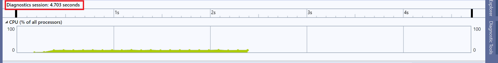
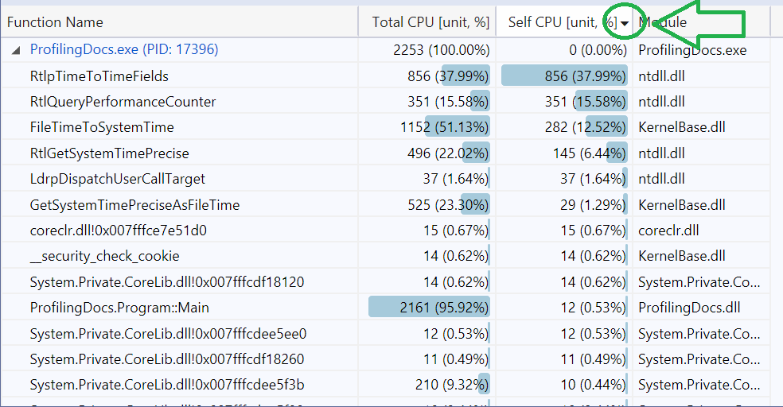

# Profiling workflow for CoreFX

## Table of Contents

- [Prerequisites](#Prerequisites)
  - [Build](#Build)
  - [Repro](#Repro)
  - [Project Settings](#Project-Settings)
- [Profiling on Windows](#Profiling-on-Windows)
  - [Visual Studio Profiler](#Visual-Studio-Profiler)


## Prerequisites

This doc explains how to profile local CoreFX and CoreCLR builds and it's targetted at CoreFX and CoreCLR contributors.

### Build

If you are interested in profiling some parts of `System.Private.CoreLib.dll` and **being able to see the source code in Visual Studio Profiler**, you need to build CoreCLR in Release first:

```cmd
C:\Projects\coreclr> build -release
```

The next step is to build CoreFX in Release and provide the path to CoreCLR via [CoreCLROverridePath](https://github.com/dotnet/corefx/blob/0e7236fda21a07302b14030c82f79bb981c723a6/Documentation/project-docs/developer-guide.md#testing-with-private-coreclr-bits) build parameter:

```cmd
C:\Projects\corefx> build -c Release /p:CoreCLROverridePath="C:\Projects\coreclr\bin\Product\Windows_NT.x64.Release"
```

If you don't care about detailed `System.Private.CoreLib.dll` info you can just build the CoreFX itself:

```cmd
C:\Projects\corefx> build -c Release
```

The build produces two things that we care about:

* `dotnet` and all `System.XYZ.dlls` used internally by CoreFX to run unit tests. It can be used by Visual Studio Profiler to run the code that you want to profile. Example:

```log
C:\Projects\corefx\artifacts\bin\testhost\netcoreapp-Windows_NT-Release-x64\dotnet.exe
```

* `CoreRun` and all `System.XYZ.dlls` that can be used to run the code that you want to profile. Example:

```log
C:\Projects\corefx\artifacts\bin\runtime\netcoreapp-Windows_NT-Release-x64\CoreRun.exe
```

Once you rebuild the part of CoreFX you are working on, the appropriate `.dll` gets updated and the next time you run profiler, dotnet|CoreRun is going to use the updated library.

```cmd
C:\Projects\corefx\src\System.Text.RegularExpressions\src> dotnet msbuild /p:ConfigurationGroup=Release
```

### Repro

The next step is to prepare a small console app that executes the code that you want to profile. The app **should run for at least a few seconds** and **keep the overhead as small as possible to make sure it does not dominate the profile**.

Following code can be used to profile the [DateTime.UtcNow](https://github.com/dotnet/coreclr/issues/25728):

```cs
using System;

namespace ProfilingDocs
{
    class Program
    {
        static int Main()
        {
            long ticks = 0;

            for (int i = 0; i < 30_000_000; i++) // 30_000_000 is enough to run for 2-3 seconds
            {
                ticks ^= DateTime.UtcNow.Ticks; // xor is cheap operation (modulo is not)
            }

            return (int)ticks; // return the result to prevent from dead code elimination
        }
    }
}
```

**Hint**: If you need to implement some initialization logic you can extract it to a standalone method and use `[MethodImpl]` to prevent from inlining. It's going to make it easier for you to filter the profiler output: instead of filtering by time you are going to be able to filter to a single method.

```cs
class Program
{
    static void Main()
    {
        var sut = Setup();

        WhatYouCareAbout(sut);
    }

    [MethodImpl(MethodImplOptions.NoInlining)]
    private static $SomeType Setup() { }

    [MethodImpl(MethodImplOptions.NoInlining)]
    private static void WhatYouCareAbout($SomeType sut) { }
}
```

### Project Settings

It's recommended to disable Tiered JIT (to avoid the need of warmup) and emit full symbols (not enabled by default for Release builds):

```xml
<Project Sdk="Microsoft.NET.Sdk">

  <PropertyGroup>
    <OutputType>Exe</OutputType>
    <TargetFramework>netcoreapp3.0</TargetFramework>

    <DebugType>pdbonly</DebugType>
    <DebugSymbols>true</DebugSymbols>

    <TieredCompilation>false</TieredCompilation>
  </PropertyGroup>

</Project>

```

## Profiling on Windows

### Visual Studio Profiler

Visual Studio Profiler is not as powerful as PerfView, but it's definitely more intuitive to use. If you don't know which profiler to use, you should use it by default.

To profile a local build of CoreFX and get symbol solving working in Visual Studio Profiler you can use the produced `dotnet` or `CoreRun`.

#### dotnet

Following script launches a Visual Studio solution with environment variables required to use a local version of the .NET Core SDK:

```cmd
@ECHO OFF
SETLOCAL

:: This tells .NET Core to use the dotnet.exe passed as first argument to the script
SET DOTNET_ROOT=%1

:: This tells .NET Core not to go looking for .NET Core in other places
SET DOTNET_MULTILEVEL_LOOKUP=0

:: Put our local dotnet.exe on PATH first so Visual Studio knows which one to use
SET PATH=%DOTNET_ROOT%;%PATH%

SET sln=%2

:: This starts VS
start %sln%
```

You can just save it as `startvs.cmd` file and run providing path to the `testhost` folder produced by CoreFX build and a VS solution with repo project:

```cmd
startvs.cmd "C:\Projects\corefx\artifacts\bin\testhost\netcoreapp-Windows_NT-Release-x64\" "C:\Projects\repro\ProfilingDocs.sln"
```

Once you started the VS with the right environment variables you need to click on the `Debug` menu item and then choose `Performance Profiler` or just press `Alt+F2`:


Switch to `Release` configuration, check `CPU Usage` and just click `Start`:


Give VS a few seconds to run. It's important to execute enough code to run for at least a few seconds to let the profiler gather enough samples:



By default VS Profiler does not show the [External Code](https://docs.microsoft.com/en-us/visualstudio/profiling/beginners-guide-to-performance-profiling?view=vs-2019#view-external-code) (functions in system and framework component). When you are profiling CoreFX or CoreCLR this is **the most important thing you care about**. To show the external code click `Filter` then check `Show External Code` and click `Apply` button.


If you don't do that, then VS is going to tell you that most of the time was spent in "External Code" but you won't be able to tell what code was it exactly.


From here, you should be able to [analyze](https://docs.microsoft.com/en-us/visualstudio/profiling/beginners-guide-to-performance-profiling?view=vs-2019#step-2-analyze-cpu-usage-data) the profile.

You can either click on the `Main` method and drill into interesting methods:


Or just sort the methods by exclusive CPU time by clicking on the `Self CPU` column and clicking on the most time-consuming method name.



If you have configured everything properly you are able to see the CPU time spent per source code line!


