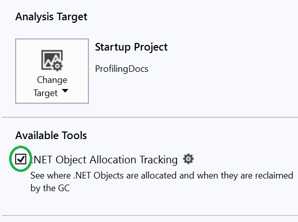
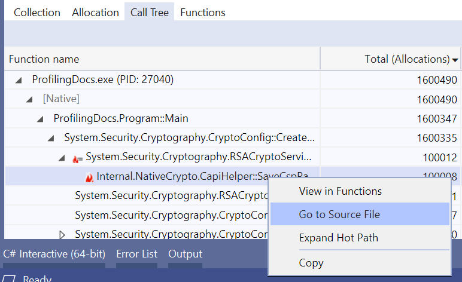

# Profiling workflow for CoreFX

## Table of Contents

- [Prerequisites](#Prerequisites)
  - [Build](#Build)
  - [Repro](#Repro)
  - [Project Settings](#Project-Settings)
- [Profiling on Windows](#Profiling-on-Windows)
  - [Visual Studio Profiler](#Visual-Studio-Profiler)
    - [dotnet](#dotnet)
    - [CPU](#CPU)
    - [CoreRun](#CoreRun)
    - [Allocation Tracking](#Allocation-Tracking)
  - [PerfView](#PerfView)
    - [CPU Investigation](#CPU-Investigation)
      - [Filtering](#Filtering)
      - [Analyzing the Results](#Analyzing-the-Results)
      - [Viewing Source Code](#Viewing-Source-Code)
      - [Identifying Regressions](#Identifying-Regressions)
  - [VTune](#VTune)
    - [When to use](#When-to-use)
    - [Identifying Hotspots](#Identifying-Hotspots)
    - [Problems](#Problems)
      - [Code](#Code)
      - [Skids](#Skids)
- [PerfCollect](#PerfCollect)
  - [Preparing Your Machine](#Preparing-Your-Machine)
  - [Preparing Repro](#Preparing-Repro)
  - [Collecting a Trace](#Collecting-a-Trace)
  - [Analyzing the Trace](#Analyzing-the-Trace)

## Prerequisites

This doc explains how to profile local CoreFX and CoreCLR builds and it's targetted at CoreFX and CoreCLR contributors.

### Build

If you are interested in profiling some parts of `System.Private.CoreLib.dll` and **being able to see the source code in Visual Studio Profiler**, you need to build CoreCLR in Release first:

```cmd
C:\Projects\coreclr> build -release
```

The next step is to build CoreFX in Release and provide the path to CoreCLR via [CoreCLROverridePath](https://github.com/dotnet/corefx/blob/0e7236fda21a07302b14030c82f79bb981c723a6/Documentation/project-docs/developer-guide.md#testing-with-private-coreclr-bits) build parameter:

```cmd
C:\Projects\corefx> build -c Release /p:CoreCLROverridePath="C:\Projects\coreclr\bin\Product\Windows_NT.x64.Release"
```

If you don't care about detailed `System.Private.CoreLib.dll` info you can just build the CoreFX itself:

```cmd
C:\Projects\corefx> build -c Release
```

The build produces two things that we care about:

* `dotnet` and all `System.XYZ.dlls` used internally by CoreFX to run unit tests. It can be used by Visual Studio Profiler to run the code that you want to profile. Example:

```log
C:\Projects\corefx\artifacts\bin\testhost\netcoreapp-Windows_NT-Release-x64\dotnet.exe
```

* `CoreRun` and all `System.XYZ.dlls` that can be used to run the code that you want to profile. Example:

```log
C:\Projects\corefx\artifacts\bin\runtime\netcoreapp-Windows_NT-Release-x64\CoreRun.exe
```

Once you rebuild the part of CoreFX you are working on, the appropriate `.dll` gets updated and the next time you run profiler, dotnet|CoreRun is going to use the updated library.

```cmd
C:\Projects\corefx\src\System.Text.RegularExpressions\src> dotnet msbuild /p:ConfigurationGroup=Release
```

### Repro

The next step is to prepare a small console app that executes the code that you want to profile. The app **should run for at least a few seconds** and **keep the overhead as small as possible to make sure it does not dominate the profile**.

Following code can be used to profile the [DateTime.UtcNow](https://github.com/dotnet/coreclr/issues/25728):

```cs
using System;

namespace ProfilingDocs
{
    class Program
    {
        static int Main()
        {
            long ticks = 0;

            for (int i = 0; i < 30_000_000; i++) // 30_000_000 is enough to run for 2-3 seconds
            {
                ticks ^= DateTime.UtcNow.Ticks; // xor is cheap operation (modulo is not)
            }

            return (int)ticks; // return the result to prevent from dead code elimination
        }
    }
}
```

**Hint**: If you need to implement some initialization logic you can extract it to a standalone method and use `[MethodImpl]` to prevent from inlining. It's going to make it easier for you to filter the profiler output: instead of filtering by time you are going to be able to filter to a single method.

```cs
class Program
{
    static void Main() => WhatYouCareAbout(Setup());

    [MethodImpl(MethodImplOptions.NoInlining)]
    private static $SomeType Setup() { }

    [MethodImpl(MethodImplOptions.NoInlining)]
    private static void WhatYouCareAbout($SomeType initialized) { }
}
```

### Project Settings

It's recommended to disable Tiered JIT (to avoid the need of warmup) and emit full symbols (not enabled by default for Release builds):

```xml
<Project Sdk="Microsoft.NET.Sdk">

  <PropertyGroup>
    <OutputType>Exe</OutputType>
    <TargetFramework>netcoreapp3.0</TargetFramework>

    <DebugType>pdbonly</DebugType>
    <DebugSymbols>true</DebugSymbols>

    <TieredCompilation>false</TieredCompilation>
  </PropertyGroup>

</Project>

```

## Profiling on Windows

### Visual Studio Profiler

Visual Studio Profiler is not as powerful as PerfView, but it's definitely more intuitive to use. If you don't know which profiler to use, you should use it by default.

To profile a local build of CoreFX and get symbol solving working in Visual Studio Profiler you can use the produced `dotnet` or `CoreRun`.

#### dotnet

Following script launches a Visual Studio solution with environment variables required to use a local version of the .NET Core SDK:

```cmd
@ECHO OFF
SETLOCAL

:: This tells .NET Core to use the dotnet.exe passed as first argument to the script
SET DOTNET_ROOT=%1

:: This tells .NET Core not to go looking for .NET Core in other places
SET DOTNET_MULTILEVEL_LOOKUP=0

:: Put our local dotnet.exe on PATH first so Visual Studio knows which one to use
SET PATH=%DOTNET_ROOT%;%PATH%

SET sln=%2

:: This starts VS
start %sln%
```

You can just save it as `startvs.cmd` file and run providing path to the `testhost` folder produced by CoreFX build and a VS solution with repo project:

```cmd
startvs.cmd "C:\Projects\corefx\artifacts\bin\testhost\netcoreapp-Windows_NT-Release-x64\" "C:\Projects\repro\ProfilingDocs.sln"
```

#### CPU

Once you started the VS with the right environment variables you need to click on the `Debug` menu item and then choose `Performance Profiler` or just press `Alt+F2`:


Switch to `Release` configuration, check `CPU Usage` and just click `Start`:


Give VS a few seconds to run. It's important to execute enough code to run for at least a few seconds to let the profiler gather enough samples:


By default VS Profiler does not show the [External Code](https://docs.microsoft.com/en-us/visualstudio/profiling/beginners-guide-to-performance-profiling?view=vs-2019#view-external-code) (functions in system and framework component). When you are profiling CoreFX or CoreCLR this is **the most important thing you care about**. To show the external code click `Filter` then check `Show External Code` and click `Apply` button.


If you don't do that, then VS is going to tell you that most of the time was spent in "External Code" but you won't be able to tell what code was it exactly.


From here, you should be able to [analyze](https://docs.microsoft.com/en-us/visualstudio/profiling/beginners-guide-to-performance-profiling?view=vs-2019#step-2-analyze-cpu-usage-data) the profile.

You can either click on the `Main` method and drill into interesting methods:


Or just sort the methods by exclusive CPU time by clicking on the `Self CPU` column and clicking on the most time-consuming method name.


If you have configured everything properly you are able to see the CPU time spent per source code line!


#### CoreRun

If you prefer to use CoreRun instead of dotnet you need to select `Launch an executable`


And provide the neccessary arguments (path to the compiled repro dll):


The alternative is to run the repro app using CoreRun yourself and use VS Profiler to attach to a running process:


#### Allocation Tracking

Since `DateTime.UtcNow` does not allocate managed memory, we are going to profile a different app:

```cs
using System.Runtime.CompilerServices;
using System.Security.Cryptography;

namespace ProfilingDocs
{
    class Program
    {
        static void Main()
        {
            for (int i = 0; i < 100_000; i++)
            {
                Consume(CryptoConfig.CreateFromName("RSA"));
            }
        }

        [MethodImpl(MethodImplOptions.NoInlining)]
        private static void Consume<T>(in T _) { }
    }
}
```

To track memory allocation you need to check `.NET Object Allocation Tracking` in the performance wizard and click `Start`.



The reported results contain information about all allocated .NET objects.


Again, if you have configured everything properly you are able to right click on method name and Go to Source File!




### PerfView

PerfView is the ultimate .NET Profiler and if you are new to PerfView it's recommended to read it's tutorial or watch the tutorial [videos](https://channel9.msdn.com/Series/PerfView-Tutorial).


#### CPU Investigation

We can **Collect** profile data by either **Run**ning a standalone executable (or command) or **Collect**ing the data machine wide with explicit start and stop.


When profiling local CoreFX build it's recommended to Run a standalone repro app using CoreRun.


If for some reason PerfView fails to run the command you need to click the `Log` button in left bottom corner and read the logs to find out what happened.


Once PerfView finishes the run you need to open the `CPU Stacks`


By default PerfView collects the profile data machine wide. Once you click on the `CPU Stacks` it shows you a window with the list of processes active during profile session. It sorts the processes descending by CPU time so the most active processes are at the top. You just need to select `CoreRun` and click `OK`.


Once you do that it opens the `CPU Stacks` window with the default filtering applied.


The first thing you need to do is to make sure that you have at least a few 1000 samples (preferably over 5000) and that the process is actually CPU bound.

The `Metric/Interval` is a quick measurement of how CPU bound the trace is as a whole. A value of 1 indicates a program that on average consumes all the CPU from a single processor. Unless that is high, your problem is not CPU (it can be some blocking operation like network/disk read).


##### Filtering

Fundamentally, what is collected by the PerfView profiler is a sequence of stacks. A stack is collected every millisecond for each hardware processor on the machine. This is very detailed information and hence by default PerfView groups the stacks. This is very useful when you are profiling a real-world application in a production environment, but when you work on the .NET Team and you profile some simple repro app you care about all details and you don't want the results to be grouped by modules.


This is why you should disable the grouping by selecting `[no grouping]` item from `GroupPats` combo box. If you want to learn more about `GroupPats` just click on it (it looks like a web link and it opens help).


Now you can see much more details:


But some of the results contain `!?` which means unsolved symbols.


To solve the symbols you just need to select given names, right click and choose `Lookup symbols`. You can also just press `Ctrl+A` (select all) and `Alt+S` (Lookup symbols).


PerfView does an excellent job at solving symbols. It's capable of solving not only the app code symbols but also .NET Runtime and Windows OS symbols. It's one of the moments when it shines compared to other profilers that very often struggle with that.

When we are using the `Collect -> Run` option PerfView profiles entire process lifetime. It's very useful when you are interested in things like .NET Runtime startup performance. But typically you just care about specific method. So the next thing you need to do is to set the Time Range. You can do that by selecting the interesting method, right clicking and choosing `Set Time Range`. Or just pressing `Alt+R`.


As you can see, all the methods that were executed before the first and after last call to `DateTime.UtcNow` got filtered out:


`When` - This is a visualization of how the INCLUSIVE samples collected for that node vary over time.   The total range (from the Start and End text boxes), is divided into 32 time 'TimeBuckets' and the inclusive samples for that node are accumulated into those 32 buckets.   Each bucket is then represented as a digit that represents a scaled value.

This simple text representation of histogram can be very useful when profiling more complex scenarios, but in this case it just shows us that `DateTime.UtcNow` was executed all the time. But this is exactly what we wanted!

##### Analyzing the Results

Once we get the data filtered we can start the analysis.

The `By Name` tab contains the list of all methods captured during profile time. This list is by default sorted in descending order by **Exc**lusive CPU time. It means that the most expensive methods which perform actual CPU computation are at the top of the table. These are the methods you care about.


To find out who is calling the most time consuming method you can right click on it and select `Goto -> Goto Item in Callers` or just press `F10`.


If you wish you can  see the entire `Call Tree` by clicking on the `Call Tree` tab:


`Flame Graph` offers you a different form of visualization::


The graph starts at the bottom. Each box represents a method in the stack (inclusive CPU time). Every parent is the caller, children are the callees. The wider the box, the more time it was on-CPU. 

For the leaf nodes the inclusive time == exclusive time. The difference between the parent and children box width (marked with red on the image below) is the exclusive parent (caller) time.

```cs
parent.InclusiveTime - children.InclusiveTime = parent.ExclusiveTime
```


##### Viewing Source Code

If you want to view the Source Code of the given method you need to right-click on it and select `Goto Source (Def)` menu item. Or just press `Alt+D`.


If PerfView fails to show you the source code you should read the `Log` output. If you are unable to make it work and you really care about it you should switch to Visual Studio Profiler.

**Note:** As of today, PerfView keeps the `.pdb` files [opened](https://github.com/microsoft/perfview/pull/979) after showing the source code. It means that if you keep the trace file opened in PerfView and try to rebuild CoreFX/CLR the build is going to fail. You might need to close PerfView to rebuild CoreFX/CLR.

##### Identifying Regressions

PerfView has a built-in support for identifying regressions. To use it you need to:

* profile two different versions of .NET Core running exact same C# code
* open both trace files in PerfView and apply exactly the same filters
* choose `Regression -> With Baseline` from the top Menu


It's recommended to use it instead of trying to eyeball complex Flame Graphs.

### VTune

Intel VTune is a very powerful profiler that allows for low-level profiling:

* provides micro-architecture specific analysis
* identifies hot spots and bottlenecks
* utilizes MSRs to get additional low-level hardware information

#### When to use

Let's use PerfView to profile the following app that tries to reproduce [Potential regression: Dictionary of Value Types #25842 ](https://github.com/dotnet/coreclr/issues/25842):

```cs
using System.Collections.Generic;
using System.Linq;
using System.Runtime.CompilerServices;

namespace ProfilingDocs
{
    class Program
    {
        const int LastElement = 512;

        static void Main()
        {
            Dictionary<int, int> dictionary = Enumerable.Range(start: 0, count: LastElement).ToDictionary(x => x);

            ActualJob(dictionary);
        }

        [MethodImpl(MethodImplOptions.NoInlining)]
        private static bool ActualJob(Dictionary<int, int> dictionary)
        {
            bool result = false;

            for (int i = 0; i < 3_000_000; i++)
            {
                for (int notFound = LastElement + 1; notFound < LastElement * 2; notFound++)
                {
                    result ^= dictionary.TryGetValue(notFound, out _);
                }
            }

            return result;
        }
    }
}
```

PerfView tells us that 70% of exclusive CPU time was spent in `FindEntry` method:


Once we [open](https://github.com/dotnet/coreclr/blob/4aa65f077778c7c05211825f98684aae9c52caaf/src/System.Private.CoreLib/shared/System/Collections/Generic/Dictionary.cs#L363-L460) the source code of `FindEntry` method we can see that:

* there are two execution paths based on whether `IEqualityComparer<TKey>` was provided or not (`comparer == null`)
* there is a separate execution path for Value Types (`default(TKey)! != null`) and another for reference types
* JIT can **devirtualize** the calls to `EqualityComparer<TValue>.Default` intrinsic. It means that calls to `Equals` and `GetHashCode` can get **inlined**. Which means that neither VS Profiler or PerfView are going to be able to assign profile samples to source code of the inlined method (the samples are going to be assigned to inlinee - `FindEntry` method).

When we open the Flame Graph we can see that the Call Stack ends at `FindEntry` method. So `Equals` and `GetHashCode` got devirtualized and inlined.


**You should start every investigation with VS Profiler or PerfView. When you get to a point where you clearly need information on CPU instruction level and you are using Intel hardware, use VTune.**

#### Identifying Hotspots

Run VTune **as Administrator** and click `New Project`:


Provide the project name and click `Create Project`:


Specify path to CoreRun and provide the path to repro library as a parameter:


Choose `Hardware Event-Based Sampling` and check `Collect Stacks`:


**Note:** to `Hardware Event-Based Sampling` is available only if you don't have virtualization enabled. You might gonna need to reboot your PC and disable virtualization in BIOS to get it working.

**Important:** It's recommended to use `Hardware Event-Based Sampling` for small repro apps that run shorther that one minute. If you use `User-Mode Sampling` VTune might fail to recognize the module and assign vast majority of the profile samples (and CPU time) to `[Outside any know module]`.


Now you are good to go! Just click the start button:


VTune is going to run provided app and display a summary after it's done processing the profile data:


Similar to PerfView, when we use Start button VTune profiles entire process lifetime. Since this time we are not interested in .NET Runtime startup performance we need to filter the profile. You can do that by selecting the interesting method, right clicking and choosing `Filter in by Selection`:


As you can see, we've filtered out a lot of noise and now `ActualJob` is 100% of the inclusive time.


We can now sort the methods by exclusive time by clicking on the `CPU Time: Self` column name:


Right click on the most expensive method and choose `View Source`:


Which shows us that 6.68s out of 9.390 (`ActualJob` inclusive CPU time) was spent for modulo operation!


To go to the next hotsopot you can to click the `Go to Smaller Function Hotspot` button:


#### Problems

If you ever run into any problem with VTune, you should check the `Collection Log`:


If the error message does not tell you anything and you can't find any similar reports on the internet, you can ask for help on the [Intel VTune Amplifier forum](https://software.intel.com/en-us/forums/intel-vtune-amplifier).

##### Code

VTune is capable of showing not only the output assembly code but also native and managed source code.


If it ever fails to show the source code (the `Source` button is then greyed out), you can click on the `Search Sources/Binaries` button and specify additional folders that should be searched for symbol and source files.

**Note:** According to the VTune [docs](https://software.intel.com/en-us/vtune-amplifier-help-dialog-box-source-search), the search is non-recursive. So adding just `corefx` and `coreclr` repo root folders to the list is not enough.


##### Skids

Hardware Event-Based Sampling is vulnerable to [skids](https://github.com/brendangregg/skid-testing). When the event occurs, the counter increments and when it reaches the max interval value the event is fired with **current** Instruction Pointer. As an example we can use following source code:

```cs
bool result ^= dictionary.TryGetValue(notFound, out _);
```

The profiler shows that a lot of inclusive CPU time was spent on the `xor` operation. Obviously, it's not true and it was most probably spent in the `call` to `TryGetValue` method. It means that to fully understand the output of Hardware Event-Based Sampling profilers you also need to be familiar with assembly code.


## PerfCollect

PerfCollect is a simple, yet very powerful script that allows for profiling .NET Core apps on Linux. It is internally leveraging LTTng and using perf.

In contrary to `dotnet trace` it gives you native call stacks which are very useful when you need to profile native parts of CoreFX/CLR.

It has it's own excellent [documentation](https://github.com/dotnet/coreclr/blob/master/Documentation/project-docs/linux-performance-tracing.md) (a **highly recommended read**), the goal of this doc is not to duplicate it, but rather show **how to profile local CoreFX/CLR build running on a Linux VM from a Windows developer machine**. We need two OSes because as of today only PerfView is capable of opening a `PerfCollect` trace file.

### Preparing Your Machine

You need to install the script, make it an executable and run as sudo with `install` parameter to install all the dependencies.

```cmd
curl -OL https://aka.ms/perfcollect
chmod +x perfcollect
sudo ./perfcollect install
```

### Preparing Repro

Before you collect a trace, you need to prepare a [Repro](#Repro). As of today, `PerfCollect` does not give you the possibility to run a standalone executable. It collects the data machine wide with explicit start and stop. The simplest way to create a repo app is to simply put the code that you want to profile inside a `while(true)` loop.

As an example, we are going to use following app that tries to reproduce [String.StartsWith slower on Linux with some characters #40674](https://github.com/dotnet/corefx/issues/40674)

```cs
using System.Runtime.CompilerServices;

namespace ProfilingDocs
{
    class Program
    {
        static void Main()
        {
            Console.WriteLine("Started running. Press Ctrl+C to stop.");

            while (true)
            {
                Consume(string.Concat(new string('a', 512), "-").StartsWith("i"));
            }
        }

        [MethodImpl(MethodImplOptions.NoInlining)]
        private static void Consume<T>(in T _) { }
    }
}
```

**Note:** You can just build the repro app on your Windows dev machine and copy the output app to your Linux VM using `scp`.

```cmd
scp -r "C:\Users\adsitnik\source\repos\ProfilingDocs\ProfilingDocs\bin\Release\netcoreapp3.0\ProfilingDocs.dll" adsitnik@11.222.33.444:/home/adsitnik/Projects/coreclr/bin/tests/Linux.x64.Release/Tests/Core_Root/ProfilingDocs.dll
```

### Collecting a Trace

To collect a trace, you need to open two terminals:

* one for controlling tracing, referred to as [Trace]
* one for running the application, referred to as [App].

**[App]**: Setup the application shell - this enables tracing configuration inside of CoreCLR:

```cmd
export COMPlus_PerfMapEnabled=1
export COMPlus_EnableEventLog=1
```

**[Trace]** Start collection:

```cmd
sudo ./perfcollect collect slowStartsWith
```

**[App]**: Run the repro app using `corerun`. It's recommended to use `corerun` because it has `crossgen` required to solve native symbols in the same folder and hence native symbol solving is going to work out of the box:

```cmd
cd /home/adsitnik/Projects/coreclr/bin/tests/Linux.x64.Release/Tests/Core_Root/
./corerun ./ProfilingDocs.dll
```

**[Trace]** Wait few seconds to let PerfCollect gather some samples and stop collection by pressing `Ctrl+C` in the trace terminal:

```cmd
^C
...STOPPED.


Trace saved to slowStartsWith.trace.zip
```

**[App]**: don't forget to stop your app by pressing `Ctrl+C` as well.


### Analyzing the Trace

As mentioned previously, currently only PerfView is capable of opening a `PerfCollect` trace file. So to analyze the trace file you need to copy it to a Windows machine. You can do that by using `scp`.

```cmd
scp -r adsitnik@11.222.33.444:/home/adsitnik/Projects/tracing/slowStartsWith.zip C:\traces\startsWith
```

Once you get it there, you need to open it with PerfView and follow the [filtering instructions](#filtering) to filter the trace and [analyze the results](#Analyzing-the-Results).

