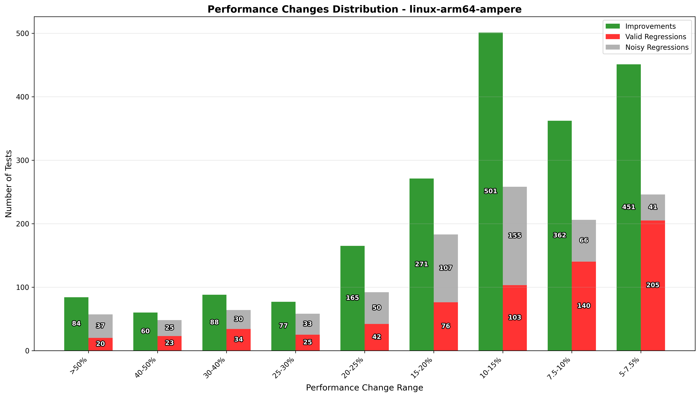

# .NET 9 to .NET 10 Performance Reports

This directory contains reports detailing performance changes that occurred between .NET 9 and .NET 10. Below is a list of the available reports. Please note we only have linked the regressions to the commits that caused them, and improvements are unlinked and may contain noise. Some linked commits may not be the exact commit reponsible, but were a best guess at the likely commit given the range of commits that the regression occurred in.

- CoreCLR x64 Windows: ([Regressions](./windows-x64-tiger_regression_report.md), [Improvements](./windows-x64-tiger_improvement_report.md))
- CoreCLR x64 Linux: ([Regressions](./linux-x64-tiger_regression_report.md), [Improvements](./linux-x64-tiger_improvement_report.md))
- CoreCLR Arm64 Linux: ([Regressions](./linux-arm64-ampere_regression_report.md), [Improvements](./linux-arm64-ampere_improvement_report.md))
- Mono x64 Linux: ([Regressions](./linux-mono-tiger_regression_report.md), [Improvements](./linux-mono-tiger_improvement_report.md))
- MonoAOT Arm64 Linux: ([Regressions](./linux-monoaot-ampere_regression_report.md), [Improvements](./linux-monoaot-ampere_improvement_report.md))
- WASM x64 Linux: ([Regressions](./linux-wasm-tiger_regression_report.md), [Improvements](./linux-wasm-tiger_improvement_report.md))
- WASM AOT x64 Linux (Viper): ([Regressions](./linux-wasmaot-viper_regression_report.md), [Improvements](./linux-wasmaot-viper_improvement_report.md))

## Summary Histograms

The histograms below show the distribution of performance changes across different .NET configurations, categorized by the magnitude of change. Each chart displays:

- **Valid Regressions**: Performance decreases that have been confirmed and linked to specific commits
- **Noisy Regressions**: Performance decreases that were detected but marked as potentially unreliable due to measurement noise
- **Improvements**: Performance increases (includes both valid improvements and noisy measurements, as these have not been individually validated)

**Important considerations when interpreting this data:**

1. **Test coverage varies by feature**: Different .NET features have different numbers of performance tests. A single code change might appear as 1 regression or as many as 30+ regressions depending on how many tests exercise that particular feature.

2. **Improvements are unvalidated**: Unlike regressions, improvements have not been individually verified, so some may be due to measurement noise rather than actual performance gains.

3. **For detailed analysis**: Review the individual regression and improvement reports linked above to understand the root causes and specific changes responsible for performance impacts.

### CoreCLR x64 Windows

### CoreCLR x64 Linux

### CoreCLR Arm64 Linux

### Mono x64 Linux

### MonoAOT Arm64 Linux

### WASM x64 Linux

### WASM AOT x64 Linux (Viper)

