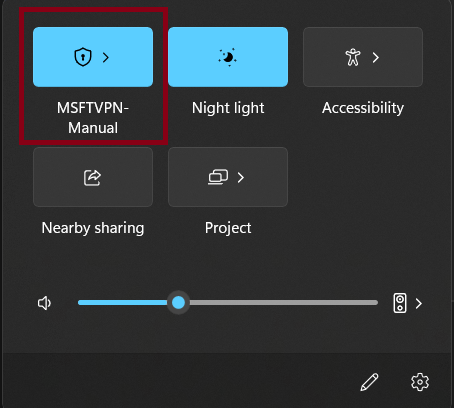

# ASP.NET Benchmarks

## Troubleshooting

There are four main types of errors while running ASP.NET Benchmarks using crank and these are:

### 1. Inability To Connect To The Server

The typical error message associated with this is of the following form:

```cmd
The specified endpoint url 'http://asp-citrine-win:5001' for 'application' is invalid or not responsive: "No such host is known. (asp-citrine-win:5001)"
```

This is as a result of not being connected to CorpNet. To troubleshoot this issue, ensure you are connected to CorpNet by making sure your VPN is appropriately set:


Additionally, the reason for the error could be because the associated machine is down. Reaching out to the appropriate ASP.NET machine owners is the best option here.

### 2. Incorrect Crank Arguments

Fix arguments by refering to [this](https://github.com/dotnet/crank/blob/main/src/Microsoft.Crank.Controller/README.md) document. If you are still experiencing issues even though you have checked that the crank commands are correct, ensure that you have the latest version of crank.

### 3. Test Failures

The test failures could be as a result of either runtime failures or failures of running the benchmark on the managed side of things. For both of these issues examine the log file to identify the reasons.

### 4. Missing Artifacts

For the case of missing artifacts such as missing traces, examine the log file for the exception reasons.
