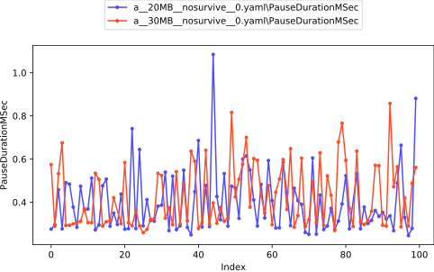
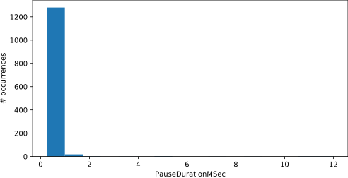

# Example

Compared to the README tutorial, this is more detailed and uses more commands.

This document uses command line syntax for simplicity, but the same things can be done using the Jupyter notebook.

We're going to see how changing gen0size affects performance. We'll start by creating a benchfile `bench/compare_gen0size.yaml`.

```yaml
vary: config
test_executables:
  defgcperfsim: /performance/artifacts/bin/GCPerfSim/release/netcoreapp5.0/GCPerfSim.dll
coreclrs:
  a:
    core_root: ./coreclr
options:
  collect: thread_times
  default_iteration_count: 3
common_config:
  complus_gcserver: true
  complus_gcconcurrent: false
configs:
  '20MB':
    complus_gcgen0size: 0x1400000
  '30MB':
    complus_gcgen0size: 0x1e00000
benchmarks:
  nosurvive:
    arguments:
      tc: 8
      lohar: 0
      tagb: 400
      tlgb: 0
      sohsi: 0
      sohpi: 0
      lohpi: 0
      allocType: reference
```

This benchfile expects a Core_Root to have been moved to `bench/coreclr`. (Meaning it is now named `coreclr` instead of `Core_Root`.)

The path in `defgcperfsim` under `test_executables` is just the default where
`GCPerfSim.dll` is built inside the repo. Make sure you write the full path in
your bench files.

We would normally start an investigation with `collect: gc` or `collect: none` instead of `collect: thread_times` but for an example it's more convenient to only have to run tests once.

You can reduce the `default_iteration_count` to have your tests finish faster, although this might likely cause your results to be less accurate.

Run with:

```sh
py . run bench/compare_gen0size.yaml
```

To get a basic comparison we can just use `diff` with the default settings.

```sh
py . diff bench/compare_gen0size.yaml
```

The summary shows the most interesting metrics -- when gen0 size increased, the PctTimePausedInGC went down, but `HeapSizeBeforeMB_Mean` went up. These are shown more in the detailed tables:

```text
Large Regressions (Regression of >20%)

     Metric │ Base (run 0 │ Stdev % │ New (run 0) │ Stdev % │ % Diff │  Abs Diff
            │           ) │         │             │         │        │
────────────┼─────────────┼─────────┼─────────────┼─────────┼────────┼──────────
HeapSizeBef │         166 │    0.77 │         243 │    0.94 │   46.8 │      77.5
oreMB_Max   │             │         │             │         │        │
────────────┼─────────────┼─────────┼─────────────┼─────────┼────────┼──────────
HeapSizeBef │         149 │    0.26 │         222 │    0.17 │   48.7 │      72.6
oreMB_Mean  │             │         │             │         │        │
```

```text
Large Improvements (Improvement of >20%)

     Metric │ Base (run 0 │ Stdev % │ New (run 0) │ Stdev % │ % Diff │  Abs Diff
            │           ) │         │             │         │        │
────────────┼─────────────┼─────────┼─────────────┼─────────┼────────┼──────────
CountIsGen0 │        1881 │    0.24 │        1310 │    0.18 │  -30.4 │      -571
────────────┼─────────────┼─────────┼─────────────┼─────────┼────────┼──────────
CountIsGen1 │          18 │       0 │          14 │     4.1 │  -22.2 │        -4
────────────┼─────────────┼─────────┼─────────────┼─────────┼────────┼──────────
PauseDurati │        1.36 │      16 │        1.07 │      10 │  -21.7 │    -0.295
onMSec_95PW │             │         │             │         │        │
hereIsGen0  │             │         │             │         │        │
────────────┼─────────────┼─────────┼─────────────┼─────────┼────────┼──────────
PauseDurati │       0.714 │      11 │       0.434 │     1.9 │  -39.3 │    -0.280
onSeconds_S │             │         │             │         │        │
um          │             │         │             │         │        │
```

Increasing gen0size increased the time of individual GCs, but reduced the number of GCs and thus reduced total time spent in GC.

To get a more detailed look, we can chart their GCs side by side.

```sh
py . chart-individual-gcs bench/compare_gen0size.yaml.out/a__20MB__nosurvive__0.yaml bench/compare_gen0size.yaml.out/a__30MB__nosurvive__0.yaml
```

This shows us a default set of metrics. You'll notice that PauseDurationMSec has a few spikes since we're including all GCs regardless of generation. We can fix that with a `--gc-where` clause. While we're at it, let's reduce clutter and show only the first 100 GCs.

```sh
py . chart-individual-gcs bench/compare_gen0size.yaml.out/a__20MB__nosurvive__0.yaml bench/compare_gen0size.yaml.out/a__30MB__nosurvive__0.yaml --gc-where Generation=0 Index<100 --x-single-gc-metric Index --y-single-gc-metrics PauseDurationMSec
```

The chart should look something like:



Looks good -- the greater size doesn't increase pause durations.

We can confirm what we saw in the chart with text:

```sh
py . analyze-single bench/compare_gen0size.yaml.out\a__30MB__nosurvive__0.yaml --show-first-n-gcs 20 --gc-where Generation=0 
```

In the output you'll see a list of GCs.

```text
                          ┌───────────────────────┐
                          │ Single gcs (first 20) │
                          └───────────────────────┘


  gc num │ Genera │ AllocR │ Alloce │ PauseD │ Promot │ HeapSi │ HeapSi │ UsesCo
     ber │   tion │ ateMBS │ dSince │ uratio │   edMB │ zeBefo │ zeAfte │ mpacti
         │        │     ec │ LastGC │  nMSec │        │   reMB │    rMB │     on
         │        │        │     MB │        │        │        │        │
  ───────┼────────┼────────┼────────┼────────┼────────┼────────┼────────┼───────
     643 │      0 │ 2.82e+ │    239 │  0.575 │ 0.0182 │    241 │   1.65 │   True
         │        │     04 │        │        │        │        │        │
  ───────┼────────┼────────┼────────┼────────┼────────┼────────┼────────┼───────
     644 │      0 │ 2.78e+ │    217 │  0.289 │ 0.0190 │    219 │   1.67 │   True
         │        │     04 │        │        │        │        │        │
  ───────┼────────┼────────┼────────┼────────┼────────┼────────┼────────┼───────
     645 │      0 │ 2.74e+ │    218 │  0.532 │ 0.0220 │    221 │   1.69 │   True
         │        │     04 │        │        │        │        │        │
```

The output is fairly homogenous. You may see gaps in `gc number` since  these are only the gen 0 GCs. This textual output can be a good first step for investigation since it shows you many metrics at once on one screen, rather than having to make many different charts.

Another way to look for pause times is by a histogram.

```sh
py . chart-individual-gcs-histogram  bench/compare_gen0size.yaml.out/a__30MB__nosurvive__0.yaml --gc-where Generation=0 --single-gc-metrics PauseDurationMSec
```



Looking good, most gen0 GCs have low pauses.

Just for fun, let's look for the worst gen 0 GC.

```sh
py . analyze-single bench/compare_gen0size.yaml.out/a__30MB__nosurvive__0.yaml --gc-where Generation=0 --sort-gcs-descending PauseDurationMSec
```

```text
                          ┌───────────────────────┐
                          │ Single gcs (first 10) │
                          └───────────────────────┘


  gc nu │ Pause │ Gener │ Alloc │ Alloc │ Pause │ Promo │ HeapS │ HeapS │ UsesCo
   mber │ Durat │ ation │ RateM │ edSin │ Durat │ tedMB │ izeBe │ izeAf │ mpacti
        │ ionMS │       │  BSec │ ceLas │ ionMS │       │ foreM │ terMB │     on
        │    ec │       │       │ tGCMB │    ec │       │     B │       │
  ──────┼───────┼───────┼───────┼───────┼───────┼───────┼───────┼───────┼───────
   1680 │  12.0 │     0 │ 2.39e │   218 │  12.0 │ 0.017 │   220 │ 0.582 │   True
        │       │       │   +04 │       │       │     6 │       │       │
  ──────┼───────┼───────┼───────┼───────┼───────┼───────┼───────┼───────┼───────
   1689 │  12.0 │     0 │ 2.35e │   217 │  12.0 │ 0.014 │   218 │ 0.740 │   True
        │       │       │   +04 │       │       │     2 │       │       │
...
```

Not too interesting -- the very worst is only 12MS. Remember the gc number, 1680. We'll use that for the next command:

```sh
py . analyze-joins-single-gc bench/compare_gen0size.yaml.out/a__30MB__nosurvive__0.yaml --gc-number 1680
```

```text

                                      ┌────────┐
                                      │ phases │
                                      └────────┘


init -- approx. 11.8ms (98.1%) (span 15704.48 15716.27) (EE suspended)

                     heap │     0 │     1 │     2 │     3 │     4 │     5 │     6 │     7
  ────────────────────────┼───────┼───────┼───────┼───────┼───────┼───────┼───────┼──────
                    total │ 11.78 │ 11.78 │ 11.77 │ 11.77 │ 11.77 │ 11.77 │ 11.78 │ 11.76
  ────────────────────────┼───────┼───────┼───────┼───────┼───────┼───────┼───────┼──────
                  working │  0.05 │  0.06 │  0.05 │  0.07 │  0.06 │  0.06 │  0.07 │ 11.73
  ────────────────────────┼───────┼───────┼───────┼───────┼───────┼───────┼───────┼──────
          single_threaded │  0.00 │  0.00 │  0.00 │  0.00 │  0.00 │  0.00 │  0.00 │  0.01
  ────────────────────────┼───────┼───────┼───────┼───────┼───────┼───────┼───────┼──────
               restarting │  0.00 │  0.00 │  0.00 │  0.00 │  0.00 │  0.00 │  0.00 │  0.01
  ────────────────────────┼───────┼───────┼───────┼───────┼───────┼───────┼───────┼──────
          waiting_in_join │ 11.73 │ 11.72 │ 11.70 │ 11.70 │ 11.71 │ 11.71 │ 11.70 │  0.00
  ────────────────────────┼───────┼───────┼───────┼───────┼───────┼───────┼───────┼──────
                   stolen │  0.00 │  0.00 │  0.02 │  0.00 │  0.00 │  0.00 │  0.00 │  0.00
  ────────────────────────┼───────┼───────┼───────┼───────┼───────┼───────┼───────┼──────
  idle_for_no_good_reason │  0.00 │  0.00 │  0.00 │  0.00 │  0.00 │  0.00 │  0.00 │  0.00


mark -- approx. 0.138ms (1.15%) (span 15716.24 15716.38) (EE suspended)
...
```

According to this, most of the time for this GC was spent in init. (You probably won't see this in your own analysis if you're following along, as this was due to chance.) This shows heap 7 spending 11.73 seconds working in init and holding the other threads up. This is often due to stolen time, but in this case that is 0. Just to verify, stolen time instances are listed at the bottom.

```text
Top 1 worst stolen time instances:

  time span ( │ process │ duration (m │ heap │ prior state │       stage │ phase
          ms) │         │          s) │      │             │             │
  ────────────┼─────────┼─────────────┼──────┼─────────────┼─────────────┼──────
  15704.51 15 │ firefox │      0.0209 │    2 │     working │ generation_ │  init
       704.53 │         │             │      │             │  determined │
```

This stole from heap 2 instead of 7, so it's unrelated.
