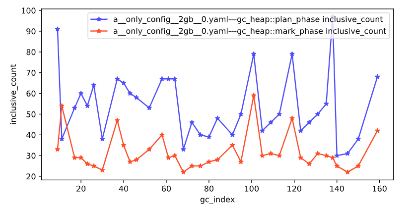
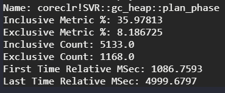
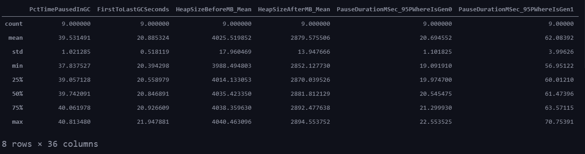
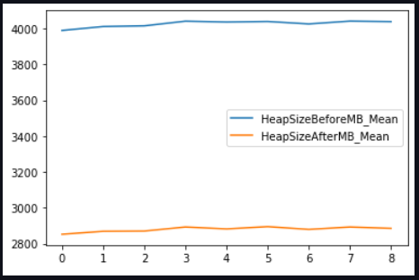

# Using with Jupyter Notebook

A jupyter notebook has already been set up in `jupyter_notebook.py`. So far,
it's only been tested with VSCode.

## Using with VSCode

* Run `code .` in the `/performance/src/benchmarks/gc` directory.
* Open `jupyter_notebook.py`.
* Open your settings and enable `"editor.codeLens": true,`.
* Wait a minute for CodeLens to show up in the notebook.

## Overview

* Click on `Run cell` in the top cell. This is the only cell that is not optional to run.
* Each of the other cells corresponds to some command. Instead of providing command
  line arguments, edit the code to provide different arguments to the function.
  You can then re-run that cell without needing to reload traces.
* The top cell specifies all the trace files and metrics that will be available.
  If you need to add new files or metrics you will need to rerun the top cell.
* If you edit code in any other file you will have to reload the whole notebook.
  See the ⟲ icon in the top-right.
* You can also do any custom analysis on the trace. The `custom` section at the
  bottom shows how to manually sum all GC times.

## CPU Samples Analysis

CPU Samples Analysis is a set of features in active development. It is currently
only usable through Jupyter Notebook, as will be described in this section.

The following functionalities are supported:

* Chart CPU Samples metrics of one or more functions, for one or more GC's,
  given one or more traces. A list of supported metrics is described later on.
* Show various CPU Samples metrics, such as inclusive and exclusive sample count,
  for a function within a given time range.

### Requirements and Setup
 
To begin with, capture a trace with CPU Samples enabled. If you use GC Infra, then
you're good to go. If you capture it elsewhere, make sure to include the `process_name`
and the `seconds_taken` fields in the [test status yaml file](test_status_files.md).

You will also need to provide the path to where you have your _Core\_Root's_ PDB's
with the symbols. If you built it from the runtime repo as specified [here](building_coreroot.md),
they should be in the following path (assuming you built for Windows x64):

```sh
/runtime/artifacts/bin/coreclr/Windows_NT.x64.Release/PDB/
```

Once the previous requirements are fulfilled, open the _Jupyter Notebook_ in VS Code.
There, make sure to run the first cell, which is in charge of setting up and loading
all the libraries and components required for analysis. Then, read your trace
with the following code:

```python
_MY_TRACE = get_trace_with_everything("Path/To/Test/Status/File.yaml")
```

Next, you need to create an _"utilities"_ object associated with your trace.
This object will create and store for you the necessary components used by
GCPerf and TraceEvent to read and analyze the trace as you require. Build it
with the following code:

```python
_MY_TRACE_ALL_DATA = TraceReadAndParseUtils(
    ptrace=_MY_TRACE,
    symbol_path=Path("Path/To/PDB/Directory"),
)
```

Now you can choose between the two functionalities mentioned above. But before
that, don't forget to import their respective functions:

```python
from src.analysis.analyze_cpu_samples import chart_cpu_samples_per_gcs, show_cpu_samples_metrics
```

### Charting CPU Samples per GC's

The following function will create a chart from the given CPU Samples metric from
the given function(s) per individual GC's. You can filter those to a certain criteria
as well (e.g. Gen1 GC's only). Also, you can provide more than one trace for a
more complex comparison.

The currently supported metrics to chart from a given function are the following:

* Inclusive Number of CPU Samples _("inclusive\_count")_
* Exclusive Number of CPU Samples _("exclusive\_count")_
* Inclusive Percent of CPU Samples _("inclusive\_metric\_percent")_
* Exclusive Percent of CPU Samples _("exclusive\_metric\_percent")_
* Time of First Sample _("first\_time\_msec")_
* Time of Last Sample _("last\_time\_msec")_

In this example, we will be charting the _inclusive number of samples_ from the
functions `gc_heap::plan_phase` and `gc_heap::mark_phase`, for all Generation 1 GC's.

```python
chart_cpu_samples_per_gcs(
    ptraces_utils=(_MY_TRACE_ALL_DATA,),
    functions_to_chart=("gc_heap::plan_phase", "gc_heap::mark_phase",),
    x_property_name="gc_index",
    y_property_names=("inclusive_count",),
    gc_filter=lambda gc: gc.Generation == Gens.Gen1,
)
```

Splitting this function call's parts:

* `ptraces_utils`: List of all the utilities objects of the traces you wish
  to chart. This parameter must be a list, so don't forget the parentheses even
  if it's just one trace.
* `functions_to_chart`: List of the functions you wish to chart.
* `x_property_name`: The chart's X-Axis metric. We want to enlist the individual
  GC's in this example, so we use the _gc\_index_ as the metric.
* `y_property_names`: List of the metrics you wish to chart.
* `gc_filter`: Function to filter the GC's you wish to chart. If you want all of
  the GC's in your trace, you can simply omit this parameter.

Running this yields the following output:



### Show CPU Samples Metrics

The following function will show you the main CPU Samples Metrics of a given
function from your trace, in the specified time range (if any).

In this example, we will be looking at the samples metrics for the `gc_heap::plan_phase`
function, from the 1,000 msec mark to the 5,000 msec mark of the test's execution.

```python
show_cpu_samples_metrics(
    ptrace_utils=_MY_TRACE_ALL_DATA,
    function="gc_heap::plan_phase",
    start_time_msec=1000.0,
    end_time_msec=5000.0,
)
```

Splitting this function call's parts:

* `ptrace_utils`: The utilities object of the trace you wish to analyze. Note
  that as opposed to the charting function, this one only receives one trace
  instead of a list.
* `function`: Name of the function you wish to see samples metrics values.
* `start_time_msec`: Timestamp in msec where you want to begin your analysis.
  You can omit this parameter to analyze since the beginning of the trace.
* `end_time_msec`: Timestamp in msec where you want to end your analysis. You can
  omit this parameter to analyze until the end of the trace. This is the main
  reason it is vital to have the `seconds_taken` field in your _test status yaml file_.

Running this yields the following output:



## Numeric Analysis

Numeric Analysis is a feature that allows you to use the `pandas` library to
analyze GC metrics from various runs of a *GCPerfSim* test. It reads all these
metrics numbers from all the iterations for the test run, and builds a list
with them, ready for `pandas` to consume and interpret it. Some of the main
tasks you can do with your data are, but not limited to:

* See summary statistical values (e.g. mean, min, max)
* Filter subsets of data
* Create various types of plots to graphically visualize data (scatter, histogram, line)
* Add new calculated columns for ease of access and more complicated calculations.

This feature is currently only available by means of the Jupyter Notebook.
Following are the steps to set this up, as well as a simple example showing
this feature in action.

For the full pandas documentation, you can check their [website](https://pandas.pydata.org/docs/).

### Requirements

First, run any *GCPerfSim* test you want to analyze multiple times. It all depends
on your goal for how many, but when working with statistics, the more the merrier.

Once your tests are done running, open up `jupyter_notebook.py` in *VSCode* and
run the first cell for general setup. Once that is done, there is a basic
working template at the end of the notebook.

### Setting up in Jupyter Notebook

```python
_BENCH = Path("bench")
_SUITE = Path("bench") / "suite"
_TRACE_PATH = _SUITE / "normal_server.yaml"

data = get_gc_metrics_numbers_for_jupyter(
    traces=ALL_TRACES,
    bench_file_path=_TRACE_PATH,
    run_metrics=parse_run_metrics_arg(("important",)),
    machines=None,
)
```

In this example, we ran multiple times the `normal_server` test with the `2gb` benchmark.
As shown above, the `get_gc_metrics_numbers_for_jupyter()` function is in charge
of reading the traces of each time the test was run, fetching the numbers data,
and returning a list of dictionaries. Each dictionary contains each metric's value
mapped to the metric's name of a specific run. These are the same that are shown
when issuing `py . diff`.

We have all the data now, but it's not ready to be consumed by `pandas`. `Pandas`
expects a dictionary which symbolizes the table you would usually build in statistics,
and transforms it into a `DataFrame` of its own. The next cell arranges the information
and builds this dictionary:

```python
import pandas

metric_names_found = {}
for test_iteration in data:
    for metric_key in test_iteration:
        metric_names_found[metric_key] = True

data_dict = {}
for metric_name in metric_names_found:
    metric_values = []

    for test_iteration in data:
        value = test_iteration[metric_name]
        metric_values.append(value)
    data_dict[metric_name] = metric_values

data_frame = pandas.DataFrame.from_dict(data_dict)
```

The first loop is to look up which metrics are found in the data we extracted
in the previous step. The second loop creates the dictionary `pandas` expects
to create the `DataFrame`, which is composed of the following way:

* **Keys**: Metric Name
* **Values**: List with said metric's numbers from each iteration of the test run.

### Perform Data Analysis

Now you're ready to do any statistical analysis, chart plotting, and more using
the capabilities `pandas` has to offer. The most basic example is asking for
the `describe()` method:

```python
data_frame.describe()
```

This shows a table with the main statistics values using the numbers you provided.



Another important use case to mention, is that you can also extract subsets of
data and analyze them separately. For example, here we want to visualize the
heap sizes before and after garbage collection throughout the tests we ran.

```python
heap_sizes = data_frame[["HeapSizeBeforeMB_Mean", "HeapSizeAfterMB_Mean"]]
heap_sizes.plot()
```



We can observe here that the heap sizes didn't change much between tests. You might
observe different behaviors depending on what tests you run and how the settings
are changes (e.g. a `2gb` benchmark will probably look different than a `4gb` one).

## Programming Notes

Here are some internal implementation notes to be aware of when doing simple tests using the Jupyter Notebook.

### Individual GC Information

Each time you process a trace, each GC's information (such as whether it's Gen1,
uses compaction, etc) is stored in an object called `ProcessedGC`. Some of these
property values can show unexpected behavior in remote cases, such as not
existing, and to avoid unnecessary failures, they are wrapped in custom-defined
types called `Failable` types. The downside to this is it becomes harder to get
the actual value when doing detailed inspections of traces.

These `Failable` types are defined under `src/analysis/types.py`. They implement
the _Result_ type from the [_PyPI_ API](https://pypi.org/project/result/), which
wraps the value in either an `Ok()` or an `Err()` object.

You can either validate or extract the actual received value with the following
functions:

* To validate: Use `.is_ok()` or `.is_err()`.
* To extract the value: Use `.value`.
    * If you know what behavior happened, you can also use `.ok()` and `.err()` respectively.
